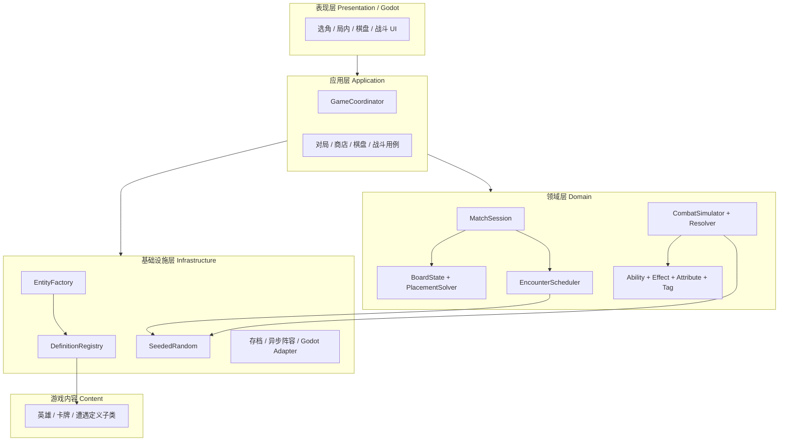
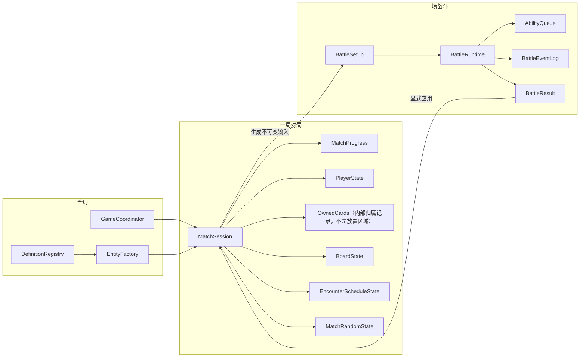
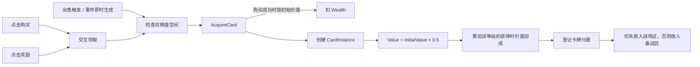
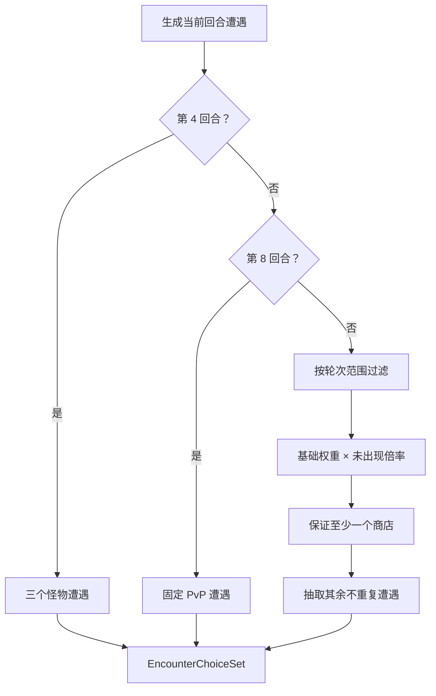
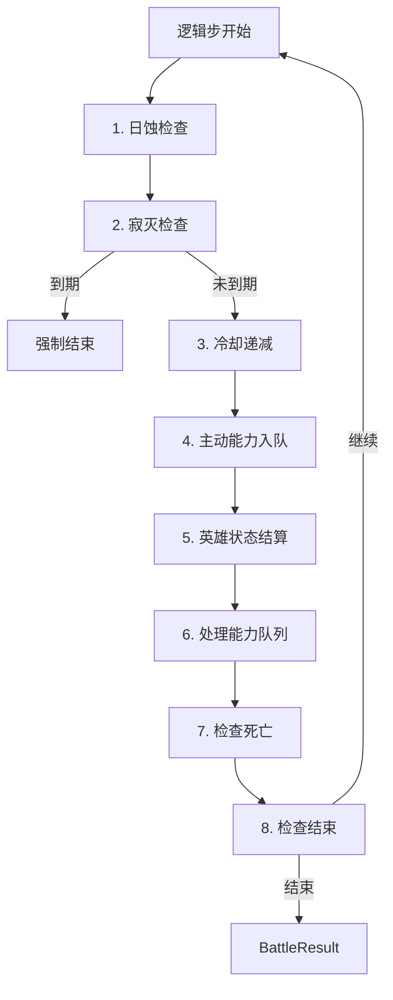

# Project_Star 架构说明

本文档依据 `docs/GAME_DESIGN.md` 的玩法需求，定义代码边界、数据所有权、依赖方向和运行流程。`AGENTS.md` 是项目导航入口，术语以 `docs/GLOSSARY.md` 为准；本文不改变玩法规则。

## 1. 架构目标

- 对局状态不跨局泄漏，整局数据可整体创建和销毁。
- 战斗只修改临时状态，通过结果显式回写永久变化。
- 相同输入、配置和随机种子产生相同结果，支持异步 PvP 复算和回放。
- 属性、经济、棋盘、排程和战斗可脱离 Godot 场景树测试。
- 新增英雄、卡牌和遭遇主要增加内容定义，不修改核心引擎。
- UI 提交意图并读取快照，不直接修改领域对象。

## 2. 总体分层



依赖规则：

1. `Domain` 使用普通 C#，不得依赖 `Node`、场景树、渲染帧或 UI。
2. `Application` 编排完整用例，但不实现游戏公式。
3. `Infrastructure` 实现反射、随机、存储和 Godot 适配。
4. `Presentation` 只能通过应用层操作模型。
5. `Content` 依赖领域定义基类和通用能力，不依赖 UI。

## 3. 生命周期与所有权



### 3.1 全局

- `GameCoordinator` 只协调选角、局内和结算阶段。
- `GameCoordinator.GetSnapshot` 返回包含对局进度、资源、遭遇选择、卡牌身份、技能和双棋盘位置的只读 `MatchSnapshot`；表现层提交操作给应用用例，不直接读取聚合内部状态。
- `DefinitionRegistry` 只保存不可变定义。
- `EntityFactory` 根据定义创建独立实例。
- 全局对象不得保存本局金钱、声望、卡池或棋盘。

### 3.2 对局

`MatchSession` 是整局聚合根和唯一事实来源，拥有进度、玩家状态、卡池、独立技能集合、双棋盘、遭遇历史和本局随机状态。新对局创建新 Session；对局结束整体销毁。所有技能来源通过 `SkillAcquisitionService.AcquireSkill` 获得或合并实例。

### 3.3 战斗

对局生成不可变 `BattleSetup`，`CombatSimulator` 据此创建 `BattleRuntime`。战斗只修改 Runtime，结束后返回 `BattleResult`。对局应用层负责奖励、惩罚、胜场、声望和永久变化。

`CombatManager` 只作为 Godot/应用层运行协调器，可在对局开始时创建、战斗时启动；它不拥有规则真相。

## 4. 定义、实例与属性

### 4.1 静态定义

- `HeroDefinition`、`CardDefinition`、`SkillDefinition`、`EncounterDefinition`、`MonsterDefinition` 是抽象基类。
- 每个具体内容是非抽象子类。英雄声明身份与初始属性；卡牌声明身份、初始属性、标签和能力组合；遭遇声明身份与排程配置；怪物声明固定战斗属性与卡组。
- `DefinitionRegistry` 反射扫描并验证 key 唯一、展示名、归属、尺寸、元素属性、轮次范围和能力引用。
- `ChoiceEncounterDefinition` 使用只读选项列表和固定/加权展示槽组合通用遭遇效果，并显式声明遭遇等级；`ResolveEncounterOptionService` 使用对局随机状态生成本次选项、校验一次性选择并结算通用奖励。表现层动态读取选项，不按具体遭遇 key 分支。
- 卡牌归属 key 必须对应已有英雄阵营或统一的 `neutral`；归属用于内容池筛选，不作为运行时使用权限。
- 使用 Registry 而非 Pool：定义不会被租借、归还或作为实例复用。

### 4.2 运行实例

- `HeroInstance`、`CardInstance` 和 `SkillInstance` 具有唯一 `EntityId`。
- 英雄不持有 `TagSet`；标签只用于卡牌分类。
- 选择、购买、掉落和奖励均通过 `EntityFactory` 创建独立实例及属性集。
- 定义不可变，实例变化不得回写定义。
- 怪物使用独立的静态定义，进入战斗后仍复用与玩家相同的战斗角色属性和卡牌实例模型，不进入玩家可选英雄列表。

### 4.3 属性分区

```text
EntityAttributes
├── IdentityAttributes     只读：key、展示名、归属、尺寸、ElementKeys
├── PersistentAttributes   对局内：等级、价值、金钱、声望等
└── BaseCombatAttributes   派生战斗初始值的基础数值
```

身份字段仍位于实体属性集中，但属于只读分区。战斗状态单独存储在 `HeroBattleState` / `CardBattleState`，不写回实体本体。

卡牌的 `ElementKeys` 使用只读集合表达：

- 必须包含 1～2 个不重复的 `StringName`；
- 合法值为 `General`、`Fire`、`Water`、`Wind`、`Earth`、`Lightning`、`Wood`、`Ice`、`Light`、`Dark`；
- `General` 是普通属性值，不作为 null、空集合或默认哨兵；
- 双属性无主次，比较和确定性序列化时使用固定规范顺序；
- 当前只参与分类、筛选和能力条件，不参与克制计算。

### 4.4 Modifier

每个 `StatModifier` 包含唯一 ID、来源实体、目标属性、贡献值和生命周期。

- Apply 按 ID 添加贡献，Remove 按 ID 精确移除。
- 效果到期只移除自身贡献，不能清零整个属性。
- 疾速与迟缓按最终属性值判断抵消。

## 5. 标签与词条

- **标签 Tag**：`HashSet<StringName>`，进入代码，用于筛选、计数、位置依赖和数值计算。
- **词条 Keyword**：发动、回响、任务等文案语义，不建立独立执行引擎；实际行为由能力、条件和效果组合表达。

标签模块包含 `GameTags`、`TagSet`、`TagDisplayNames`，并从尺寸自动推导 Small / Medium / Large；未知标签显示原始 key。

## 6. 用例、命令与事件

应用层入口包括 `SelectHero`、`ChooseEncounter`、`BuyCard`、`SellCard`、`AcquireCard`、`MoveCard`、`StartBattle` 和 `AdvanceTurn`。

- Command：请求操作，可能失败。
- Result：操作的同步结果。
- Domain Event：已经发生的事实。

对局事件与战斗事件分别实现 `IMatchEvent` 和 `ICombatEvent`，互不转发。事件用于通知和被动触发，不代替有返回值的领域操作。

## 7. 卡牌经济



- 所有获得来源统一进入 `AcquireCard`。
- 购买与奖励由玩家点击领取；其他自动获得在产生时立即尝试获取。
- 获取前先检查双棋盘空间；战场区优先、备战区其次，无空间则不创建实例。
- 购买按初始价值全额扣款；出售按当前价值全额回补。
- 等级配置可以声明获得时价值加成；该加成在统一折半后累加，不改变商店初始价格。
- `RoundIncomeService` 以已结算轮次保证收入幂等；第1轮在创建对局后结算，后续轮在首次生成该轮遭遇候选前结算，避免第8回合战斗完成前提前发放。
- `CardMergeDecision` 纯函数按 key、等级和 `EntityId` 选择合并目标；`CardEconomyService` 原子提交创建或升级结果，只有创建新实例才进入自动放置。
- 出售奖励由卡牌携带通用奖励定义；随机卡牌奖励按标签和等级筛选，并使用对局随机状态确定性抽取。
- 交易是原子事务，失败不得留下部分修改。

## 8. 棋盘系统

- `BoardState`：纯数据，只保存卡牌实例 ID、顺序、起始格和占用格。
- `BoardPlacementSolver`：纯函数，评估直接放置、左推和右推。
- `BoardService`：验证所有权，协调同盘/跨区操作并原子提交。

求解器返回包含失败原因、方向、总距离、影响数量和完整移动列表的 `PlacementPlan`，不直接写棋盘。择优固定为：总距离短 → 影响卡牌少 → Right。评估前先释放拖拽卡原位，只有完整方案成功才提交。

## 9. 遭遇排程



`EncounterScheduler` 输入当前进度、遭遇定义、已出现 key 和显式随机源，输出不重复候选组。候选进入列表时立即记为“已出现”；未出现权重乘数为 2。普通回合三选一且至少一个商店，第 4 回合固定三个不同怪物遭遇，第 8 回合固定 PvP 遭遇。

型号商店通过 `ShopEncounterDefinition.CardSize` 声明商品尺寸，并通过只读 `Level` 声明商店等级。`ShopCardPoolService` 使用当前英雄归属和该尺寸生成商品池，表现层只消费筛选结果，不自行拼接筛选条件；商店等级暂不改写卡牌定义的初始等级。

正式 `MonsterDefinition` 会自动投影为怪物遭遇候选；选择后，对手工厂按定义创建独立战斗角色和卡牌实例。试玩入口允许内容扩充期少于三个怪物时展示全部现有怪物，正式排程仍要求三个不同怪物。

## 10. 战斗边界

### 10.1 BattleSetup

不可变输入包含战斗类型、双方英雄、双方战场与备战卡牌快照、双方技能快照、战斗配置和随机种子。

### 10.2 BattleRuntime

Runtime 拥有时钟、双方战斗状态、能力队列、战斗事件分发器、事件日志和永久变化收集器。所有影响结算的集合必须使用稳定顺序，不能依赖 HashSet 或 Dictionary 的遍历顺序。

### 10.3 BattleResult

结果包含 Winner、EndReason、双方幸存者、PermanentChanges，并可附统计和日志。战斗模拟器不得直接修改 `MatchSession`。

## 11. 战斗时钟与逻辑步

规则时间使用整数 tick，配置负责将秒转换为 tick，并验证周期是逻辑步长的整数倍。时间推进层只累计时钟，规则只在逻辑 tick 执行。



## 12. 能力、效果与 Resolver

`AbilityDefinition` 由 ActivationRule、TargetSelector、ManaCost、Cooldown 和 EffectDefinition 列表组成。卡牌组合通用能力，能力只读取已计算属性，不感知等级。

卡牌与技能通过通用能力来源进入同一战斗处理流程。主动能力和回响转换为 `PendingAbility` 并进入 FIFO 队列。Resolver 检查来源是否仍有效、主动能力的魔法是否充足；通过后扣除魔法、执行效果并发布事件。被动光环按当前战斗状态求值；卡牌光环来源离开战场或被摧毁后立即失效，技能来源不依赖棋盘位置。`PendingAbility.IsEcho` 标记回响来源；回响产生的事件不再触发其他回响。事件记录来源类型与实例 ID。

## 13. 数值刷新

`FinalValue = CardBaseValue + Sum(Modifiers)`。

- 基础值可依赖自身等级、标签、区域、位置和符合条件的卡牌数量。
- 外部影响通过 Modifier 主动施加。
- 禁止读取其他卡牌的最终数值。
- 非战斗时，棋盘或标签变化后清理布局来源 Modifier、重算基础值并重新施加。
- 战斗开始后使用快照，变化只留在 Runtime。
- Runtime 按能力效果登记卡牌实际支持的战斗属性；属性修改效果必须先检查对应能力，不能通过写入属性为卡牌新增能力。
- 多重保存在卡牌 Runtime 战斗属性中，正常发动时读取当前值并排入额外发动；额外发动不再次进入冷却，也不会递归生成更多多重次数。

## 14. UI 与 Godot

- UI 读取不可变 Snapshot 或只读 ViewModel。
- 拖拽、购买和选择遭遇转换为 Command。
- UI 不持有可修改的领域集合。
- 视觉资源由表现层按 key 加载。
- 战斗动画消费 `BattleEventLog`，不得反向驱动规则。

## 15. 代码目录（强制）

```text
scripts/
├── Domain/
│   ├── Common/         # Identity / Attributes / Tags / Random
│   ├── Definitions/
│   ├── Match/          # Economy / Board / Events
│   └── Combat/         # State / Abilities / Effects / Events / Resolution
├── Application/        # Match / Shop / Board / Combat 用例
├── Infrastructure/     # Reflection / Persistence / Godot
├── Presentation/       # HeroSelection / InMatch / Board / Combat
└── Content/            # Heroes / Cards / Encounters
```

所有 C# 源文件及对应 `.cs.uid` 必须位于项目根目录的 `scripts/` 下。目录表达依赖边界，不要求为每个概念创建空目录或单文件；不得在项目根目录建立与 `scripts/Domain`、`scripts/Application` 等并列的代码目录。

## 16. 测试边界

验证统一通过 Godot 内的手动测试入口执行，至少覆盖定义反射与实例隔离、标签、Modifier、经济事务、棋盘推挤与回滚、遭遇排程、能力队列与连锁、状态周期、日蚀与寂灭、对局胜负、永久变化和确定性复算。

## 17. 关键不变量

1. 定义不可变，运行实例互相独立。
2. 全局层不拥有本局玩家状态。
3. 棋盘卡牌必须存在于本局卡池，同一实例只能位于一个区域。
4. 失败的经济或棋盘操作不得产生部分修改。
5. 战斗模拟器不能直接修改对局对象。
6. 永久变化只能通过 BattleResult 回写。
7. 战斗规则不读取渲染帧时间。
8. 所有随机行为来自显式 seed 随机源。
9. UI、动画和 Godot 信号不能决定战斗结果。
10. 标签进入代码；词条仅描述能力系统表达的行为。
