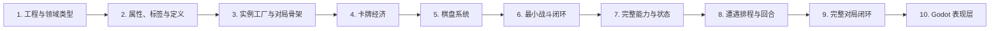

# Project_Star 实施计划

本计划依据 `docs/GAME_DESIGN.md` 的需求和 `docs/ARCHITECTURE.md` 的边界实施。`AGENTS.md` 是项目导航入口，术语定义见 `docs/GLOSSARY.md`。

## 1. 实施原则

- 每一步开始前必须与用户确认范围、规则疑问、接口边界和验收方式。
- 未经确认不进入下一步，不顺带实现后续功能。
- 每一步完成后运行 `dotnet build`；需要运行验证时提供 Godot 内的手动测试入口和验收步骤。
- 优先形成可运行的纵向闭环，再扩展完整规则。
- 领域层使用普通 C#，不得依赖 Godot 场景树。
- 不直接修改 `.godot/`，不提交 `export_presets.cfg`。

## 2. 阶段总览

## 3. 第 1 步：工程边界与基础领域类型

### 实施内容

- 建立 Domain、Application、Infrastructure、Presentation、Content 目录边界。
- 定义 `EntityId`、`SideId`、`BattleTick`、通用 Result / Failure。
- 标识性 key 统一使用 `StringName`。
- 定义可注入的 seed 随机接口和实现。
- 明确时间单位、数值类型和取整入口。

### 实施前确认

- 伤害、属性和价值分别使用何种数值类型。
- 默认逻辑步长及 0.2 秒周期的 tick 换算。
- Godot 内手动测试入口采用场景还是临时调试入口。

### 验收

- 主项目 build 通过。
- 相同 seed 输出相同随机序列。
- 领域代码不引用 Node 或场景树；`StringName` 除外。

## 4. 第 2 步：属性、Modifier、标签与静态定义

### 实施内容

- 建立只读身份、对局持久和基础战斗属性分区。
- 实现带唯一 ID 和来源的 ApplyModifier / RemoveModifier。
- 实现 `TagSet`、`GameTags`、中文显示名和尺寸标签推导。
- 实现卡牌只读 `ElementKeys`：十种合法属性、1～2 个、不重复、双属性无序。
- 建立 `HeroDefinition`、`CardDefinition`、`EncounterDefinition` 抽象基类。
- 建立少量测试定义验证继承、身份和属性隔离。
- 标签进入模型；发动、回响、任务由后续能力系统表达。

### 实施前确认

- 身份字段在属性集中的只读访问形式。
- Modifier 只支持加法，还是同时预留乘法和优先级。
- 卡牌尺寸枚举和占格数映射。
- 双属性在存储、比较和序列化时采用的固定规范顺序。

### 测试与验收

- 身份字段不可修改。
- 多来源自然累加，移除一个 Modifier 不影响其他来源。
- 尺寸正确生成型号标签，未知标签显示原始 key。
- `ElementKeys` 拒绝空集合、超过两个、重复值和未知值；`General` 按普通属性接受。
- 相同双属性以不同输入顺序创建时，得到相同的规范结果。
- build 和本步测试全部通过。

## 5. 第 3 步：定义注册、实例工厂与 MatchSession 骨架

### 实施内容

- 实现反射 `DefinitionRegistry`。
- 验证重复 key、空展示名、非法归属、尺寸和轮次范围。
- 实现 `EntityFactory`，创建独立 HeroInstance / CardInstance。
- 建立 MatchSession、MatchProgress、PlayerState、卡牌归属集合、空 BoardState、EncounterScheduleState 和 MatchRandomState。归属集合仅供内部定位实例，不作为玩法中的库存区域。
- 新对局创建全新 Session；全局对象不保存本局资源。

### 实施前确认

- key 是各类型内唯一还是所有实体全局唯一。
- 是否允许持有多张同 key 卡牌。
- EntityId 是否需要序列化以支持异步 PvP 和存档。

### 测试与验收

- 反射发现具体定义并忽略抽象类。
- 重复 key 给出明确错误。
- 同一定义的两个实例 ID、属性集完全独立。
- 两个 MatchSession 无状态共享。
- 无 Godot 场景即可创建一局、选择英雄和生成卡牌。

## 6. 第 4 步：卡牌经济与归属事务

### 实施内容

- 实现初始价值公式及特殊物品系数覆写。
- 实现统一 `AcquireCard`，供购买、掉落和奖励复用。
- 获得后设置 `Value = InitialValue × 0.5`。
- 实现按初始价值购买、按当前价值出售。
- 操作返回明确 Result，失败不产生部分修改。

### 实施前确认

- 价值小数的取整规则。
- 出售棋盘卡牌时自动移除还是要求先移出。
- 商店商品是定义引用还是独立报价项。

### 测试与验收

- 三种尺寸和特殊系数的价值正确。
- 等级改变不自动重算当前价值。
- 所有获得来源都折半。
- 余额不足不扣钱、不创建卡牌。
- 出售按现值回补且只移除一次。

## 7. 第 5 步：双棋盘与推挤算法

### 实施内容

- 实现纯数据 BoardState：战场、备战默认各 10 格，容量可配。
- 实现 BoardPlacementSolver：直接放置、释放原位、左右模拟、不可推挤和择优。
- 返回完整 PlacementPlan，不在求解阶段写棋盘。
- 实现 BoardService，原子提交同盘和跨区移动。
- 移动列表为 UI 预览和未来 undo/redo 提供数据。

### 实施前确认

- 小、中、大型卡占格数。
- 不可推挤默认值和改变途径。
- 放置失败是否严格返回原位。
- 跨区失败是否保证两个棋盘完全不变。

### 测试与验收

- 直接放置、单向和双向推挤。
- 距离、影响数量及最终 Right 择优。
- 不可推挤、容量边界、原位释放和跨区回滚。
- 同一实例不能同时存在于两个区域。
- UI 无关的棋盘操作全部通过测试。

## 8. 第 6 步：最小战斗纵向闭环

本步只打通完整链路，不一次实现全部状态和被动。

### 实施内容

- 定义不可变 BattleSetup，并从对局和棋盘生成快照。
- 实现基础 HeroBattleState / CardBattleState。
- 实现整数 tick BattleClock 和固定逻辑步。
- 实现最小 FIFO AbilityQueue 和 Resolver。
- 实现一个可复用攻击能力、伤害、死亡和 BattleResult。
- 实现 StartBattle 用例及 ApplyBattleResult 空壳。
- 记录最小 BattleEventLog。

### 实施前确认

- 英雄基础生命、卡牌初始冷却和首次发动时机。
- 护甲精确扣减规则。
- 同一 tick 双方能力的稳定入队顺序。
- 双方无法造成伤害时如何进入超时。

### 测试与验收

- BattleSetup 与对局实例隔离。
- 相同输入和 seed 产生相同结果及事件顺序。
- FIFO 顺序、死亡结果和 EndReason 正确。
- 临时生命不回写英雄本体。
- 可执行“创建对局 → 放置攻击卡 → 战斗 → 返回结果”。

## 9. 第 7 步：完整能力、效果和战斗状态

### 实施内容

- 完成 AbilityDefinition、ActivationRule、TargetSelector、EffectDefinition 和 AbilityContext。
- 主动、被动统一转换为 PendingAbility。
- 实现需求列出的强类型战斗事件。
- 实现 CanActivate、魔法扣除和 ChainPolicy。
- 实现伤害、治疗、护甲即时效果。
- 实现灼伤、中毒、生命/魔法再生、疾速、迟缓和禁锢。
- 实现状态累加、到期精确扣除和不清零。
- 实现日蚀、寂灭、A/B 超时和永久变化收集。

### 实施前确认

- 回响来源标记的传播范围（已确认：回响产生的事件不能触发其他回响）。
- 灼伤伤害与衰减的先后顺序（已确认：先伤害，每 0.2 秒减 1）。
- 中毒衰减方式（已确认：无视护甲伤害后向下减半）。
- 日蚀首次伤害时机和默认曲线。
- A/B 超时对应范围及其与寂灭的关系。
- 备战区被动的允许范围。

### 测试与验收

- 魔法不足不扣魔法、不执行。
- 主被动共用队列，顺序和连锁限制稳定。
- 多来源状态到期只移除自身贡献。
- 冷却倍率、抵消和周期边界正确。
- 灼伤优先扣护甲，中毒无视护甲。
- 同归于尽和寂灭按规则判玩家胜利。
- 永久摧毁只生成变化记录，不直接删除对局卡牌。

## 10. 第 8 步：遭遇排程、商店遭遇与轮次推进

### 实施内容

- 实现 EncounterScheduler 和可替换策略。
- 实现轮次过滤、基础权重和未出现倍率。
- 默认回合三选一且至少一个商店。
- 第 4 回合三个怪物遭遇，第 8 回合固定 PvP 遭遇。
- 跟踪本局已出现 key，新对局清空。
- 实现强类型 IMatchEvent。
- 串联商店、普通遭遇和战斗入口。

### 实施前确认

- 在生成候选还是玩家选择时记为已出现。
- 同一候选组能否重复 key。
- 候选池不足三个的降级规则。
- 未出现倍率默认值。
- 第 4/8 回合是否忽略普通遭遇的范围和权重。
- PvP 敌方阵容接口；本阶段可先用测试提供者。

### 测试与验收

- 轮次上下界、商店保底、第 4/8 回合正确。
- 未出现权重和新对局历史重置正确。
- 相同 seed 和状态生成相同候选。
- 可从第 1 回合连续推进到第 8 回合。

## 11. 第 9 步：完整对局闭环

### 实施内容

- 完成 GameCoordinator 的选角、局内和结算状态流转。
- 应用战斗奖励、惩罚和永久变化。
- 怪物战失败不扣声望。
- PvP 失败按当前轮次扣声望，且只在 PvP 后检查失败。
- 第 8 回合 PvP 胜利累计，十胜判对局胜利。
- 第 8 回合结束后轮数增加、回合重置。
- 永久摧毁按 EntityId 从卡池和棋盘移除。
- 提供只读 MatchSnapshot。

### 实施前确认

- 同场同时满足第十胜和声望归零时的优先级。
- 怪物战、PvP 奖励表是否在本阶段提供。
- Surrender 和 Draw 的声望、胜场及推进规则。
- 对局结束是否保留统计摘要或存档。

### 测试与验收

- 怪物战不错误触发声望失败。
- PvP 失败扣声望，十胜和声望归零分别正确结束对局。
- 临时战斗状态丢弃，永久摧毁仅移除指定实例。
- 新对局无上局卡池、棋盘和遭遇历史。
- 可在测试驱动器中从选角运行到胜利或失败。

## 12. 第 10 步：Godot 表现层与最小可玩版本

### 实施内容

- 实现 HeroSelectionUI、InMatchHeroUI、遭遇、商店和进度界面。
- 实现棋盘像素布局、拖拽预览和失败反馈。
- UI 通过 Command 调应用层，通过 Snapshot 刷新。
- 实现消费 BattleEventLog 的战斗表现。
- 视觉资源由表现层按 key 映射。
- 增加必要场景集成测试和人工验收清单。

### 实施前确认

- 首个版本采用 2D、3D 还是混合表现。
- 战斗实时播放、加速播放还是先结算后回放。
- 首批英雄、卡牌、怪物和普通遭遇范围。
- 视觉资源缺失时的占位策略。

### 验收

- 玩家可完成选英雄、选择遭遇、买卖、摆放、怪物战和 PvP。
- UI 不直接修改领域对象。
- 关闭一局再开新局无状态残留。
- build 和领域测试全部通过，达到最小可玩版本。

## 13. 横切工作

以下事项在首次需要时建立并持续维护：

- 配置验证和可读错误；
- 确定性日志与回放数据；
- 对局和战斗 Snapshot 版本；
- 异步 PvP 对手数据接口；
- 无场景树的批量战斗性能基准；
- 需求、术语、架构和计划同步；
- 提交格式 `<type>(<scope>): <subject>`。

## 14. 每步固定交付清单

1. 已确认范围全部实现，未夹带下一步功能。
2. `dotnet build` 通过。
3. 已提供所需的 Godot 内手动测试入口和验收步骤。
4. 新增公共接口有注释或架构说明。
5. 未直接修改 `.godot/`。
6. `bin/`、`obj/` 未进入版本控制。
7. 新规则歧义已记录，下一步开始前确认。
8. 向用户汇报变化、测试和风险，等待确认后继续。
