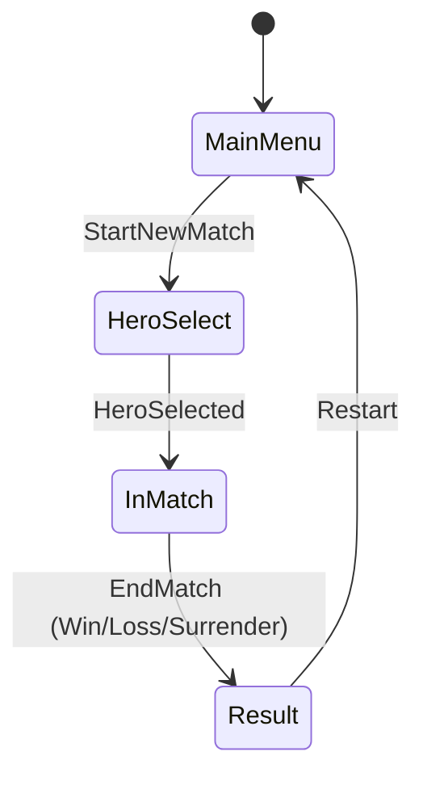
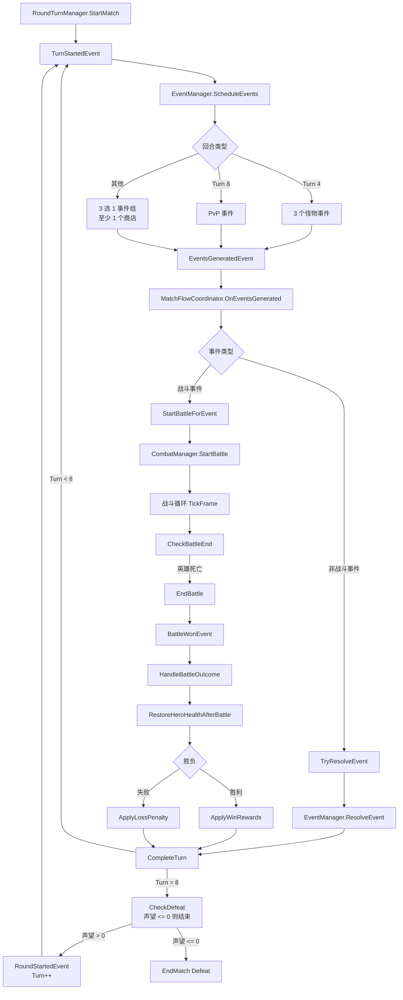
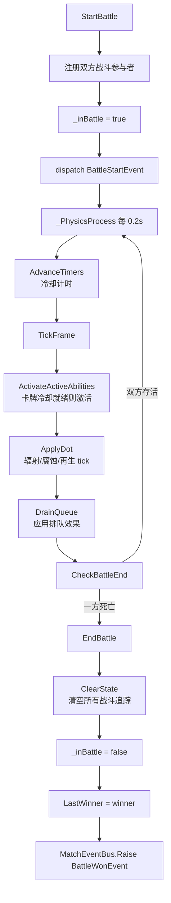
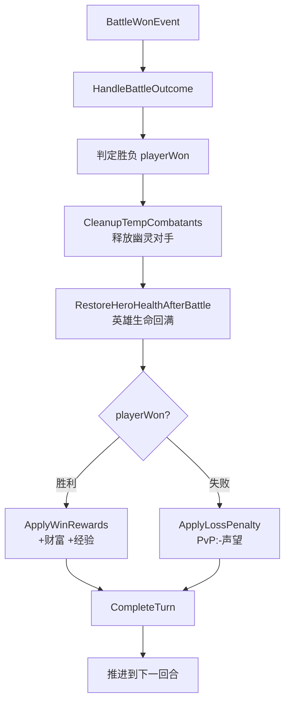
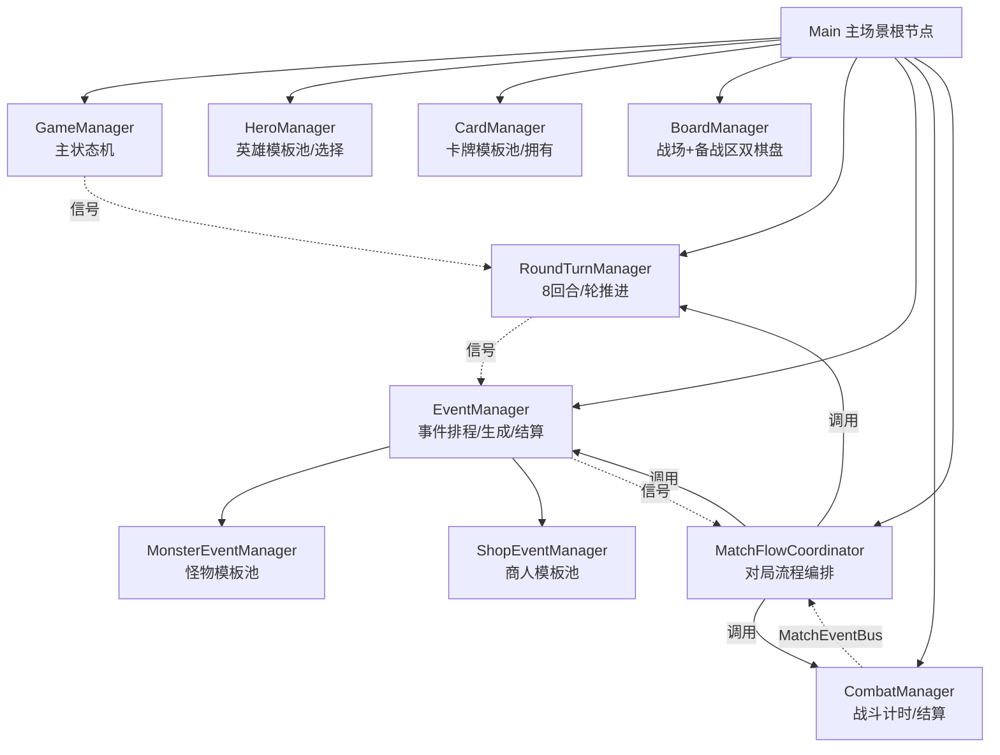
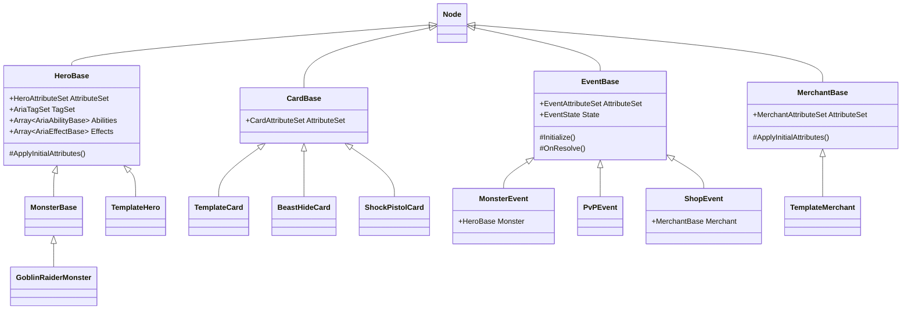

# 项目框架流程图

## 1. 游戏状态机

```mermaid
stateDiagram-v2
    [*] --> MainMenu
    MainMenu --> HeroSelect : StartNewMatch
    HeroSelect --> InMatch : HeroSelected
    InMatch --> Result : EndMatch (Win/Loss/Surrender)
    Result --> MainMenu : Restart
```

## 2. 对局轮次流程（8 回合/轮）

```mermaid
flowchart TD
    A[RoundTurnManager.StartMatch] --> B[TurnStartedEvent]
    B --> C[EventManager.ScheduleEvents]
    C --> D{回合类型}
    D -->|Turn 4| E[3 个怪物事件]
    D -->|Turn 8| F[PvP 事件]
    D -->|其他| G[3 选 1 事件组\n至少 1 个商店]
    E --> H[EventsGeneratedEvent]
    F --> H
    G --> H
    H --> I[MatchFlowCoordinator.OnEventsGenerated]
    I --> J{事件类型}
    J -->|战斗事件| K[StartBattleForEvent]
    J -->|非战斗事件| L[TryResolveEvent]
    K --> M[CombatManager.StartBattle]
    L --> N[EventManager.ResolveEvent]
    N --> O[CompleteTurn]
    M --> P[战斗循环 TickFrame]
    P --> Q[CheckBattleEnd]
    Q -->|英雄死亡| R[EndBattle]
    R --> S[BattleWonEvent]
    S --> T[HandleBattleOutcome]
    T --> U[RestoreHeroHealthAfterBattle]
    U --> V{胜负}
    V -->|胜利| W[ApplyWinRewards]
    V -->|失败| X[ApplyLossPenalty]
    W --> O
    X --> O
    O -->|Turn < 8| B
    O -->|Turn = 8| Y[CheckDefeat\n声望 <= 0 则结束]
    Y -->|声望 > 0| Z[RoundStartedEvent\nTurn++]
    Z --> B
    Y -->|声望 <= 0| AA[EndMatch Defeat]
```

## 3. 战斗生命周期

```mermaid
flowchart TD
    A[StartBattle] --> B[注册双方战斗参与者]
    B --> C[_inBattle = true]
    C --> D[dispatch BattleStartEvent]
    D --> E[_PhysicsProcess 每 0.2s]
    E --> F[AdvanceTimers\n冷却计时]
    F --> G[TickFrame]
    G --> H[ActivateActiveAbilities\n卡牌冷却就绪则激活]
    H --> I[ApplyDot\n辐射/腐蚀/再生 tick]
    I --> J[DrainQueue\n应用排队效果]
    J --> K[CheckBattleEnd]
    K -->|双方存活| E
    K -->|一方死亡| L[EndBattle]
    L --> M[ClearState\n清空所有战斗追踪]
    M --> N[_inBattle = false]
    N --> O[LastWinner = winner]
    O --> P[MatchEventBus.Raise BattleWonEvent]
```

## 4. 战果结算流程

```mermaid
flowchart TD
    A[BattleWonEvent] --> B[HandleBattleOutcome]
    B --> C[判定胜负 playerWon]
    C --> D[CleanupTempCombatants\n释放幽灵对手]
    D --> E[RestoreHeroHealthAfterBattle\n英雄生命回满]
    E --> F{playerWon?}
    F -->|胜利| G[ApplyWinRewards\n+财富 +经验]
    F -->|失败| H[ApplyLossPenalty\nPvP:-声望]
    G --> I[CompleteTurn]
    H --> I
    I --> J[推进到下一回合]
```

## 5. 管理器架构

```mermaid
graph TD
    Main[Main 主场景根节点] --> GameManager[GameManager\n主状态机]
    Main --> HeroManager[HeroManager\n英雄模板池/选择]
    Main --> CardManager[CardManager\n卡牌模板池/拥有]
    Main --> BoardManager[BoardManager\n战场+备战区双棋盘]
    Main --> RoundTurnManager[RoundTurnManager\n8回合/轮推进]
    Main --> EventManager[EventManager\n事件排程/生成/结算]
    Main --> CombatManager[CombatManager\n战斗计时/结算]
    Main --> MatchFlowCoordinator[MatchFlowCoordinator\n对局流程编排]

    EventManager --> MonsterEventManager[MonsterEventManager\n怪物模板池]
    EventManager --> ShopEventManager[ShopEventManager\n商人模板池]

    MatchFlowCoordinator -->|调用| CombatManager
    MatchFlowCoordinator -->|调用| RoundTurnManager
    MatchFlowCoordinator -->|调用| EventManager

    GameManager -.->|信号| RoundTurnManager
    RoundTurnManager -.->|信号| EventManager
    EventManager -.->|信号| MatchFlowCoordinator
    CombatManager -.->|MatchEventBus| MatchFlowCoordinator
```

## 6. 实体继承关系

```mermaid
classDiagram
    class Node

    class HeroBase {
        +HeroAttributeSet AttributeSet
        +AriaTagSet TagSet
        +Array~AriaAbilityBase~ Abilities
        +Array~AriaEffectBase~ Effects
        #ApplyInitialAttributes()
    }
    Node <|-- HeroBase

    class MonsterBase {
    }
    HeroBase <|-- MonsterBase

    class TemplateHero {
    }
    HeroBase <|-- TemplateHero

    class GoblinRaiderMonster {
    }
    MonsterBase <|-- GoblinRaiderMonster

    class CardBase {
        +CardAttributeSet AttributeSet
    }
    Node <|-- CardBase

    class TemplateCard
    class BeastHideCard
    class ShockPistolCard
    CardBase <|-- TemplateCard
    CardBase <|-- BeastHideCard
    CardBase <|-- ShockPistolCard

    class EventBase {
        +EventAttributeSet AttributeSet
        +EventState State
        #Initialize()
        #OnResolve()
    }
    Node <|-- EventBase

    class MonsterEvent {
        +HeroBase Monster
    }
    EventBase <|-- MonsterEvent

    class PvPEvent
    EventBase <|-- PvPEvent

    class ShopEvent {
        +MerchantBase Merchant
    }
    EventBase <|-- ShopEvent

    class MerchantBase {
        +MerchantAttributeSet AttributeSet
        #ApplyInitialAttributes()
    }
    Node <|-- MerchantBase

    class TemplateMerchant
    MerchantBase <|-- TemplateMerchant
```
