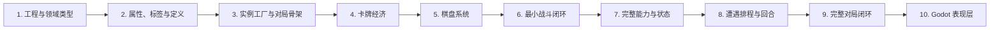

# Project_Star 实施计划

本计划依据 `docs/design/GAME_DESIGN.md` 的需求和 `docs/engineering/ARCHITECTURE.md` 的边界实施。`AGENTS.md` 是项目导航入口，术语定义见 `docs/design/GLOSSARY.md`。

## 1. 实施原则

- 每一步开始前必须与用户确认范围、规则疑问、接口边界和验收方式。
- 未经确认不进入下一步，不顺带实现后续功能。
- 每一步完成后运行 `dotnet build`；需要运行验证时提供 Godot 内的手动测试入口和验收步骤。
- 优先形成可运行的纵向闭环，再扩展完整规则。
- 领域层使用普通 C#，不得依赖 Godot 场景树。
- 不直接修改 `.godot/`，不提交 `export_presets.cfg`。

## 2. 阶段总览

## 2.1 仓库现状核对（2026-09-23）

以下状态根据当前源码和验证入口核对，表示实现覆盖情况；`dotnet build` 已通过，Godot 内验收尚未执行。

| 步骤 | 状态 | 依据 / 剩余工作 |
|---|---|---|
| 1. 工程与领域类型 | 已实现 | 基础领域类型、随机源和验证入口已存在。 |
| 2. 属性、标签与定义 | 已实现 | 属性集、Modifier、标签、元素和定义类型已存在。 |
| 3. 实例工厂与对局骨架 | 已实现 | 注册表、工厂、MatchSession 与隔离验证已存在。 |
| 4. 卡牌经济 | 已实现 | 获得、购买、出售、价值和失败原子性均有实现及验证项。 |
| 5. 棋盘系统 | 已实现 | 双棋盘、推挤求解、跨区提交和边界验证均已存在。 |
| 6. 最小战斗闭环 | 已实现 | 战斗快照、FIFO、伤害、结果与确定性验证均已存在。 |
| 7. 完整能力与状态 | 当前内容已实现，Godot 规则验证通过 | `AbilityDefinition` 保存发动类型、目标和效果；`PendingAbility` 携带来源与回响标记，队列负责发动与连锁；被动光环按当前状态求值。Godot 4.7.2 headless 运行验证场景，相关规则验证通过。 |
| 8. 遭遇排程与轮次 | 已实现 | 商店保底、特殊回合、轮次推进和确定性验证均已存在。 |
| 9. 完整对局闭环 | 当前内容已实现，Godot 规则验证通过 | `GameCoordinator` 协调创建、遭遇推进、战斗和结算；商店与事件分别通过应用用例执行。Godot 4.7.2 headless 运行验证场景，相关规则验证通过；完整试玩交互仍待人工验收。 |
| 10. Godot 表现层 | 部分实现 | 选角、遭遇、商店、双棋盘和战斗结果已有试玩界面；对局/棋盘/遭遇刷新现读取 `MatchSnapshot`，操作交给应用用例；试玩流程人工验收已由用户确认通过。表现层按 2D 奇幻插画推进，视觉方向参考 `ref/` 中的高细节明亮白金与天蓝画风；参考文件不作为项目依赖。2D 棋盘布局、拖拽预览、战斗表现方案及资源映射仍待完成。 |

### 当前执行队列

1. **内容阶段 F → G**：套装阈值与卡牌任务均通过能力解锁；任务实例进度、战斗胜利条件及战场能力生效已实现。待具体内容定义其他条件、非数值效果及正式套装/任务，再扩充其他内容。
2. **第 10 步表现层**：已确定采用 2D 表现。2026-09-30 用户要求先拆分 UI 架构、组件和数据刷新，再完善布局、交互与视觉；布局采用用户草图的顶栏及三行三列结构，金钱/收入在顶部右侧。设计见 [UI 系统方案](../design/UI_SYSTEM.md)，实施见 [UI Plan](UI_IMPLEMENTATION_PLAN.md)。P0契约与P1数据/流程重构已完成，Godot104项验证通过；P2组件与新布局尚未实施，战斗播放方式在对应阶段确认；此前试玩验收记录见 `docs/quality/MANUAL_ACCEPTANCE.md`，不代表新卡面接入与后续重构已验收。

阶段 C 的卡牌合并和通用决策器已落地；各阶段的细项与待确认规则见 `docs/planning/CONTENT_EXPANSION_PLAN.md`。

## 3. 第 10 步：Godot 表现层与最小可玩版本

### 实施内容

- 实现 HeroSelectionUI、InMatchHeroUI、遭遇、商店和进度界面。
- 实现棋盘像素布局、拖拽预览和失败反馈。
- UI 通过 Command 调应用层，通过 Snapshot 刷新。
- 实现消费 BattleEventLog 的战斗表现。
- 视觉资源由表现层按 key 映射。
- 增加必要场景集成测试和人工验收清单。

### 实施前确认

- 已确认：采用 2D 表现；美术方向参考 `ref/` 中的高细节奇幻插画、明亮白金与天蓝配色。参考文件仅用于人工查看，不进入项目依赖。
- 战斗实时播放、加速播放还是先结算后回放。
- 首批英雄、卡牌、怪物和普通遭遇范围。
- 视觉资源缺失时的占位策略。

### 验收

- 玩家可完成选英雄、选择遭遇、买卖、摆放、怪物战和 PvP。
- UI 不直接修改领域对象。
- 关闭一局再开新局无状态残留。
- build 和领域测试全部通过，达到最小可玩版本。

## 4. 横切工作

以下事项在首次需要时建立并持续维护：

- 配置验证和可读错误；
- 确定性日志与回放数据；
- 对局和战斗 Snapshot 版本；
- 异步 PvP 对手数据接口；
- 无场景树的批量战斗性能基准；
- 需求、术语、架构和计划同步；
- 提交格式 `<type>(<scope>): <subject>`。

## 5. 每步固定交付清单

1. 已确认范围全部实现，未夹带下一步功能。
2. `dotnet build` 通过。
3. 已提供所需的 Godot 内手动测试入口和验收步骤。
4. 新增公共接口有注释或架构说明。
5. 未直接修改 `.godot/`。
6. `bin/`、`obj/` 未进入版本控制。
7. 新规则歧义已记录，下一步开始前确认。
8. 向用户汇报变化、测试和风险，等待确认后继续。
